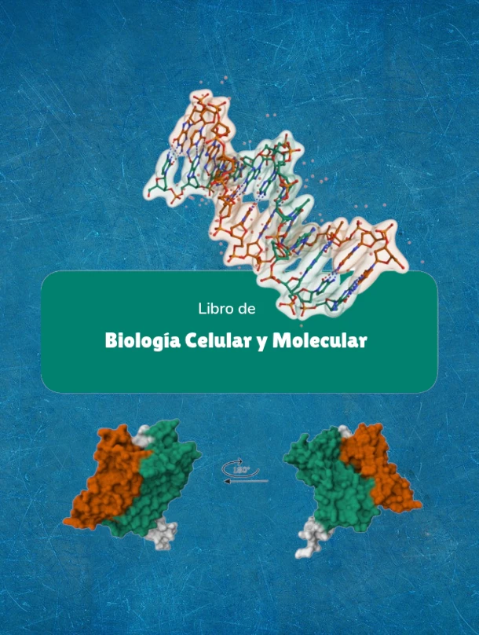

**Biología Celular y Molecular — UNSAAC (Libro Digital Vivo)**  
Iniciativa del **curso de Biología Celular y Molecular**, dictado por el **Prof. Francisco Ascue** junto con sus **estudiantes** de la **Universidad Nacional de San Antonio Abad del Cusco (Perú)**.  
Este libro es **abierto, colaborativo y en evolución continua**.

## Propósito del libro

Este proyecto reúne **conceptos fundamentales**, **figuras didácticas** y **recursos prácticos** de biología celular y molecular, con énfasis en el **rigor científico**, la **claridad pedagógica** y el **contexto andino/peruano**.  
La meta es ofrecer un material **usable en clase** y **útil para el autoaprendizaje**, que sirva como punto de partida para cursos, clubes de lectura y talleres.

## ¿A quién va dirigido?

- **Estudiantes** de pregrado y posgrado en biología, biotecnología y áreas afines.  
- **Docentes** que requieren materiales estructurados, actualizados y reutilizables.  
- **Comunidad** interesada en las ciencias de la vida.

## Qué encontrarás aquí

- **Capítulos** con explicaciones paso a paso (membranas, organelos, ADN/ARN/proteínas, señalización, metabolismo, ciclo celular, microscopía, etc.).  
- **Figuras** con texto alternativo (*alt text*) y créditos/licencias claras.  
- **Glosario** de términos esenciales y **lecturas recomendadas** (DOI/URL).  
- **Recursos docentes**: plantillas, rúbricas y guías breves para actividades.

## Cómo leer y navegar

- Usa el **índice lateral** para moverte entre capítulos.  
- Cada capítulo incluye **objetivos de aprendizaje**, **resúmenes** y **referencias**.  
- Si prefieres una copia offline, consulta la página [Comprar PDF / Donar](https://biosofhus.org.pe/biologia-celular-y-molecular/docs/Compras-y-donaciones.html) para acceder a **versiones en PDF** y apoyar la iniciativa.

## Principios editoriales

- **Rigor y accesibilidad**: precisión científica con explicaciones comprensibles.  
- **Transparencia**: indicamos fuentes, licencias y limitaciones del contenido.  
- **Mejora continua**: versión **rolling release** con revisiones frecuentes.

## Licencias y uso

- **Texto y figuras originales**: **CC BY-SA 4.0**.  
- **Código y configuraciones** (plantillas/workflows): **MIT**.  
- **Material de terceros**: se cita licencia y autoría en la leyenda.

## Cómo citar este recurso

> “**Biología Celular y Molecular — UNSAAC (Libro Digital Vivo)**. Curso del Prof. Francisco Ascue y estudiantes, UNSAAC (Perú). Versión 0.01, 2025. URL: https://biosofhus.org.pe/biologia-celular-y-molecular”

```bibtex
@book{BCM_UNSAAC_2025,
  title   = {Biología Celular y Molecular — UNSAAC (Libro Digital)},
  author  = {Francisco Ascue et al.},
  year    = {2025},
  version = {0.01},
  url     = {https://biosofhus.org.pe/biologia-celular-y-molecular},
  note    = {versión en evolución continua}
}
```
